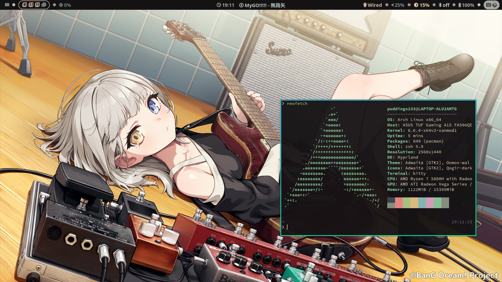

# myDotFiles  
## Screenshots  
  
## Some information  
**Note: Make sure you are familiar with the contents of the config file so that you can address any potential issues that may arise.**  
|tools|packageName[^1]|  
|:-|:-:|  
|Compositor|Hyprland[^2]|  
|Terminal|kitty|  
|Launcher|wofi|  
|Panel|waybar|  
|Editor|neovim|  
|Clipboard|wl-clipboard and clipman|  
|Screenshot|grim and slurp|  
|Screenlock|swaylock-effects|  

[^1]:In Arch Linux.
[^2]:According to [wiki](https://wiki.hyprland.org/Useful-Utilities/Must-have/ "Hyprland wiki"), there are also additional packages (dunst, pipewire, wireplumber, polkit-kde-agent, xdg-desktop-portal-hyprland) that need to be installed. 
